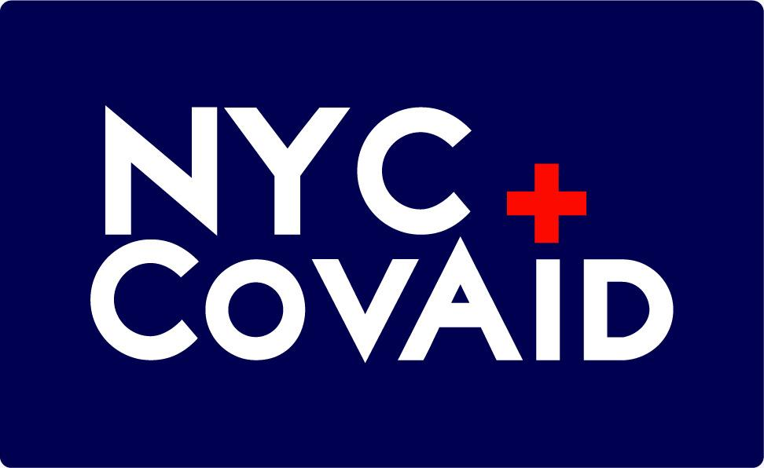

## Authors
- Katelyn Hertel
- Joseph Spens

## Demo

## Inspiration
Katelyn has always been used to volunteering in her community and outside in other parts of the world. However she is immuno-suppressed and cannot leave her apartment in NYC, right now the center of the COVID-19 pandemic in the USA. She was looking for ways to volunteer from home and found a group called Sunnyside Woodside Mutual Aid, a group set up in her local Queens neighborhood. She quickly signed up to become a dispatcher connecting in need community members with able bodied volunteers. Every shift she had she was continuously asked the same question, "Is there a map somewhere of what's open in NYC still?" The short answer is yes, but its neighborhood oriented which means each has smaller audiences. There's nothing out there right now that covers the entire city, catering to that larger audience.  

## Enter in NYC CovAid
Joseph and Katelyn decided to build a map based app that would show all the legally operating businesses in the end user's community. The idea of the app is for the end user to put in their zip code alone with the category of aid they are seeking and a map will populate in their area with all nearby open businesses fitting the aid they need. We have 18,042 records of open businesses that we were mostly able to source from Open Source NYC but the specific datasets we used can be found here:
- https://data.cityofnewyork.us/Business/Legally-Operating-Businesses/w7w3-xahh/data
- https://hifld-geoplatform.opendata.arcgis.com/datasets/pharmacies
- https://hifld-geoplatform.opendata.arcgis.com/datasets/hospitals
- https://hifld-geoplatform.opendata.arcgis.com/datasets/urgent-care-facilities
- https://www.coalitionforthehomeless.org/covid-19-resources/
- SafeGraph Grocery Store Data

## How I built it
We chose to build our app using React. We started with the Create React App program from the Facebook team. We then wrote the code to change the massive CSV file with the 18,042 records into JSON format so that it could be parsed by the app later on. We then added a list view of all the businesses we had gathered and added a filtering capability. Next we started on the map view sourced from Google Maps and worked on plotting the individual records on the map using different colors for the 30 different types of services we were able to find. We changed the filtering capabilities to include the categories of aid/services we have records to. Now all the end user has to do is enter their zip code and our program will iterate through our location data making both a listview and mapview of all available records within a half mile radius. The list view is exportable with all information including location, phone number or website, and hours of operation.

## Challenges I ran into
One of the biggest challenges we ran into was sourcing the data. It's incredibly difficult to take a bunch of resources a ton of individual contributors have put together and make a database out of it. The sheer amount of data we were working with was massive for a 36 hour project and a lot of it was entered in manually. It's also hard to use opensource data because it's not exactly tailored to what you are working on. However we were able to discover a few really great datasets that gave us the results we have.
Once the data was entered into the app it started crashing every few seconds trying to load all the records. We were able to solve this problem by adding pagination to our app so that only a certain amount of records are loaded per page. This solved our main issue of the app crashing. 

## Accomplishments that I'm proud of
We are really proud of how the app works. It does it job which was the main goal of this hackathon for us. The other thing we are really proud of is our logos. It's simple yet gives you a good idea of what the app does. 

## What's next for NYC CovAid
If given more time we would work on the look and feel of the app and of course the performance of the app. Being that we are iterating through 18k records it would be nice to have this as a hosted database of some sort so that we could work on and control performance. We also would like to work on sourcing more data. We know there are pantries or food banks we might have missed. We want this list to get as big as it can for the sake of NYCers in need during this pandemic. 